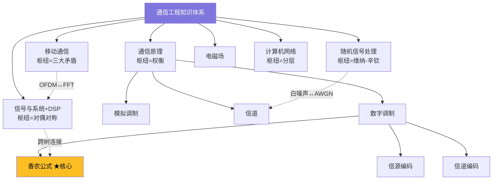
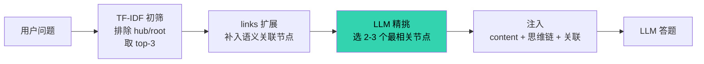

# 通信工程知识库 · Knowledge Base v2

> 一个面向**专业知识问答**的 RAG（检索增强生成）知识图谱项目：把通信工程课程知识组织成「节点 + 树层级 + Wiki 关联 + 思维链」三层结构，配套严谨的多模型评测，验证了一套优于朴素检索的方案。

<p align="center">
  
  
  
  
  
  
</p>

---

## 项目背景与动机

大语言模型（LLM）在回答**专业课程问题**时存在明显短板：对通信原理、信号处理这类需要精确概念和推理的领域，通用模型常出现**概念混淆、要点遗漏**，甚至被常见的"反直觉陷阱题"带偏（例如「DSB 与 SSB 抗噪性能是否相同」——公平比较下两者相同，但大量资料误传"SSB 更优"）。

本项目探索的核心问题是：**如何用外部知识库增强 LLM 的专业问答能力？** 并围绕它完整解决了三个子问题：

1. **知识如何表示** —— 设计「树 + Wiki + 思维链」三层知识图谱结构
2. **知识如何检索** —— 系统对比 6+ 种检索方案，找到最优解
3. **效果如何评测** —— 搭建多模型 benchmark，量化知识库的增益

---

## 项目亮点

1. **三层知识图谱结构**：树层级管分类、Wiki 连接管语义关联、思维链管推理——不是"文档库"而是"知识图谱"
2. **结论式内容写法**：每个节点"一句话本质 + 关键结论"前置，让 AI 扫一眼就能提取答案（这是本项目最大的隐性功臣）
3. **严谨的检索方案研究**：系统对比 6+ 种方案（模型自主选 / 纯 TF-IDF / 混合精挑 / links 扩展），用重复实验压噪声，得出稳定结论
4. **反直觉的发现**：内容质量 > 结构复杂度；links 的价值取决于 top-K 宽度和题目难度
5. **全模型正增益**：知识库对 8B 到 DeepSeek 全档模型都是正增益，小模型增益高达 +0.57

---

## 核心设计：节点即一切

知识库的每个 `.md` 文件是一个**知识点节点**，用三种结构组织成一个知识图谱：



**三类节点**：

| 类型 | 含义 | 特征 |
|------|------|------|
| `core` | 核心概念 | 带思维链（为什么→推导→结论） |
| `hub` | 分类文件夹 | 统领子节点，无思维链 |
| `leaf` | 叶子知识点 | 具体知识点 |

**每门课一个"贯穿性枢纽"**（写在核心节点里）：通信原理=**权衡**、DSP=**对偶对称**、移动通信=**三大矛盾**、随机信号=**维纳-辛钦**、计网=**分层**——让每门课有一条清晰的思维主线，而非知识点堆砌。

---

## 技术架构：检索流程



**最终检索方案**：`top-3 初筛 → links 扩展 → LLM 精挑 → 注入答题`。

关键洞察：**links 的价值取决于 top-K 宽度和题目难度**。top-K 越窄，初筛漏掉的正确答案越多，而这些漏掉的恰好是 links 邻居能救回的——完整题库上 links 扩展带来 **+4.8 个百分点**的召回提升。

---

## 评测结果

### 检索方案对比（116 题完整 benchmark）

| 方案 | 召回率 | 平均候选 | 说明 |
|------|:---:|:---:|------|
| 纯 top-10 + LLM | 74.3% | 10.0 | 朴素检索基线 |
| **top-3 + links + LLM** | **79.1%** | **9.8** | ✅ 最终方案（更准更省） |
| top-4 + links + LLM | 80.1% | 12.3 | 略高但候选多 20% |

### 模型增益（裸跑 vs +知识库，qwen-max 裁判）

| 模型 | 规模 | 裸跑 | +知识库 | 增益 |
|------|:---:|:---:|:---:|:---:|
| Qwen3-8B | 8B | 8.23 | 8.80 | **+0.57** |
| Qwen3-14B | 14B | 8.26 | 8.83 | **+0.57** |
| Qwen3-32B | 32B | 8.37 | 8.54 | +0.17 |
| GLM-5.2 | 大模型 | 8.46 | 8.86 | +0.40 |
| DeepSeek | 大模型 | 8.57 | 8.80 | +0.23 |

**关键结论**：知识库对**全部 5 档模型都是正增益**；小模型增益更大（裸跑分低、可补空间大）。在反直觉难题（严格裁判）上，增益进一步放大到 **+1.27**（14B）。

---

## 项目结构

```
knowledge-base/
├── knowledge-v2/          # 知识库本体（74 节点，核心）
│   ├── nodes/             # 每个 .md = 一个知识点节点
│   └── _meta/             # tree.json（树结构索引）
├── benchmark/             # 评测体系
│   ├── questions_full.json # 116 题完整题库
│   ├── 评测报告_*.html     # 可视化评测报告（4 份）
│   └── results/           # 评测原始数据
├── tools/                 # 工具脚本
│   ├── kb_benchmark.py    # 评测主脚本（多模型×裁判打分）
│   ├── build_tree.py      # 生成树结构索引
│   └── kb_lint.py         # 知识库完整性校验
└── docs/                  # 设计文档（01-06）
```

---

## 快速开始

```bash
# 1. 校验知识库
python tools/kb_lint.py

# 2. 跑评测（需配置 API key，见 tools/.env.example）
python tools/test_top34.py
```

---

## 设计文档

完整的设计思路、检索集成、评测体系见 `docs/` 目录（尤其 `06-项目归档总结.md`，含全部实验数据与踩坑记录），可视化报告见 `benchmark/评测报告_*.html`。

---

## License

本项目采用 [MIT License](LICENSE)。
