# 通信工程知识库 · Communication Knowledge Base v2

> 面向**专业知识问答**的 RAG（检索增强生成）知识图谱项目。核心贡献有三：① 把通信工程课程知识组织为「节点 + 树层级 + Wiki 关联 + 思维链（cot）」三层结构；② 配套多模型评测体系，验证了优于朴素检索的最终检索方案（top-3 + links 扩展 + LLM 精挑）；③ 在检索流水线上实现**多轮追问记忆**，让"那反过来呢""补零呢"这类裸指代追问也能接续检索。

<p align="center">
  
  
  
  
  
  
  
  
</p>

## 🌱 为什么做这个项目

两个触发点：**一是大模型答专业课常细节模糊、要点不全甚至出错；二是想把大学以来的笔记与课程思考整理成电子版。** 于是把专业课知识做成可检索的知识图谱，让 AI 回答专业问题时先查再答、有据可依。

---

## 🧭 项目全景

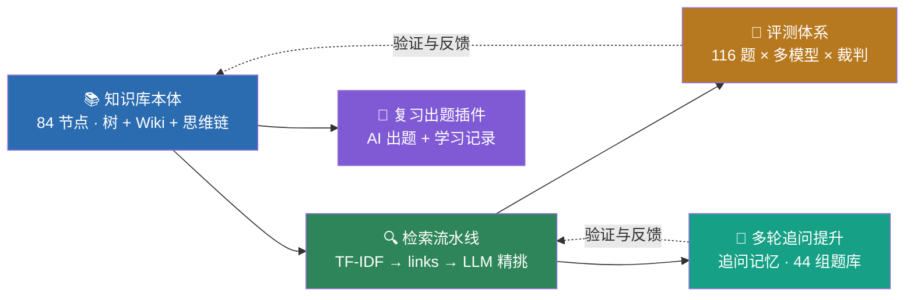

---

## 🎯 核心结果

在 116 题完整 benchmark（常规题 + 难题 + 反直觉题）上，采用**最终检索方案（top-3 + links 扩展 + LLM 精挑，method F）**，知识库对**全部 5 个模型均为正增益**，且小档模型（8B/14B）相对提升高于大档模型（32B/GLM/DeepSeek）——与「模型越大、知识库增益越大」的常见直觉相反。

> 下表为 2026-08-22 全量重跑数据（此前 8B/GLM 裸跑数据因 API 限流缺失，本次已补齐；检索方法也从历史方案 D 升级为最终方案 F）。

| 模型 | 规模 | 裸跑 | 加知识库 | 增益 | 反直觉子集增益 | 相对提升 |
|------|:---:|:---:|:---:|:---:|:---:|:---:|
| Qwen3-14B | 14B | 7.319 | 8.017 | **+0.698** | **+1.067** | **+9.54%** |
| Qwen3-8B | 8B | 7.043 | 7.612 | +0.569 | +0.667 | +8.07% |
| DeepSeek | 大模型 | 7.809 | 8.276 | +0.467 | +0.800 | +5.98% |
| Qwen3-32B | 32B | 7.496 | 7.922 | +0.427 | +0.533 | +5.69% |
| GLM-5.2 | 大模型 | 7.707 | 8.026 | +0.319 | +0.467 | +4.14% |

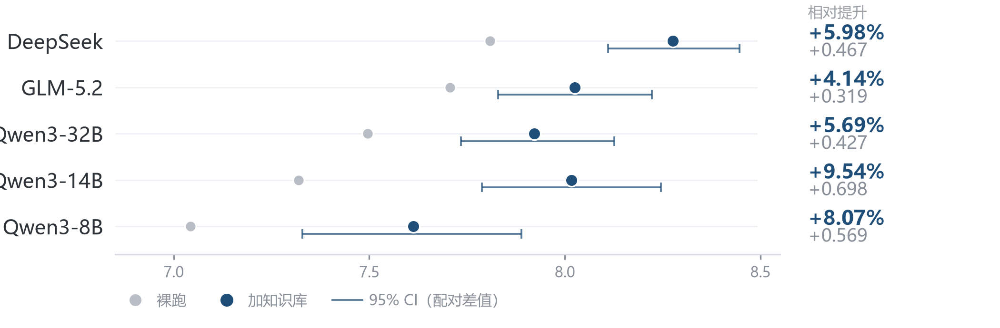

> 三条一致规律：① **全部 5 模型正增益**；② **反直觉难题子集增益 > 整体增益**（14B 达 +1.067）——题目越难、知识库价值越大；③ **小档模型相对提升 > 大档模型**（8B +8.07%、14B +9.54% vs 32B +5.69%、GLM +4.14%）——模型规模越小、越依赖外部知识（两档内非严格单调：14B 略高于 8B）。

**多轮追问**（44 组追问题库，同一检索流水线 ± 追问记忆）：追问记忆使**裸指代追问正确率提升 29 个百分点**（42% → 71%），闲聊误检率 0——详见 [💬 多轮追问提升](#多轮追问提升)。

---

## 🧪 评测可信度：为什么这些增益是真的

增益数字的可靠性直接决定实验结论的可信度。本节说明评分维度（完整度 / 正确度 / 逻辑性）、排除常见测量陷阱（尤其 LLM 裁判的长度偏见），并如实列出已知局限。

### 1. 评分维度：完整度、正确度、逻辑性

裁判（qwen-max，温度 0）按标准答案打分（0-10），评分机制如下：

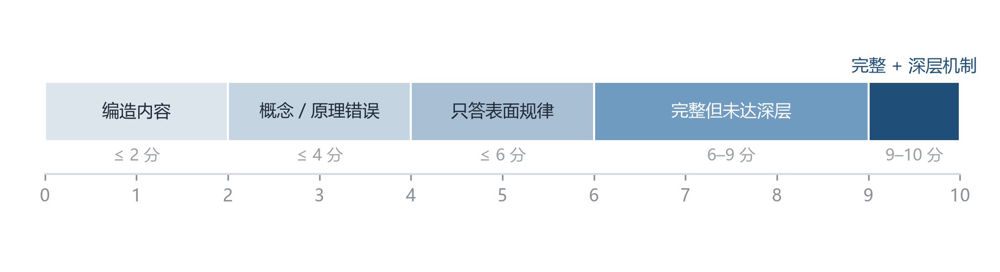

> 反直觉难题正是测「逻辑性/深刻度」：裸跑模型普遍卡在 6 分（只答表面规律），注入知识库的 **cot 思维链**后答出深层机制 → 8-9 分，这是反直觉子集增益最大（14B +1.067）的直接原因。

### 2. 长度偏见检查（LLM-as-judge 最大的质疑点）

裁判会不会"看答案长就给高分"？用本轮数据实测排除：

| 模型 | 裸跑平均长度 | +知识库平均长度 | 结论 |
|------|:---:|:---:|------|
| Qwen3-14B | 683 字符 | 628 字符（**更短**，0.92x） | 答案更短却分数更高 → 排除长度骗分 |
| DeepSeek | 706 字符 | 694 字符（几乎不变，0.98x） | 长度无变化但分数提升 → 同上 |

### 3. 提升模式分析

反直觉 15 题逐题对比，增益是「多点小提升」（14B 以 +1~+2 为主，仅 1 题 -2 的裁判波动），而非少数题暴涨——说明知识库的帮助是均匀、可复现的，不是个别题碰巧命中。

### 4. 实验卫生措施

- **同轮同裁判**：裸跑 vs +知识库在**同一轮、同一个裁判**下打分，杜绝跨轮次裁判波动（实测跨轮次裸跑基线有 ±0.5 的自然波动，故只承认轮内增益，跨轮次分数不可直接比）；
- **测量卫生**：选点失败标记 `degraded`（裸跑成绩不得冒充 +知识库）；API 调用失败（`[ERROR]`）不打分、以 -1 剔除出统计；裁判输出类型校验（score 必须是数字，防异常污染）；
- **失败重试**：每次调用 2 次重试 + 180s 超时（慢模型如 8B/32B 单独跑或分段并行，避免限流丢数据）。

### 5. 已知局限

- 反直觉子集仅 15 题，均值受单题裁判波动影响（±0.3 属正常范围）；
- qwen-max 裁判自身有非确定性（温度 0 但非严格确定），跨轮次分数不完全可比；
- 本表为 **method F（最终检索方案）** 口径，与早期 method D 的历史结果不直接可比；
- 题目覆盖通信原理 / DSP / 移动通信 / 随机信号 / 计算机网络五门课，知识库对题目领域外的泛化能力未验证。

---

## 📑 目录

- [🌱 为什么做这个项目](#为什么做这个项目)
- [🧭 项目全景](#项目全景)
- [🎯 核心结果](#核心结果)
- [🧪 评测可信度](#评测可信度为什么这些增益是真的)
- [💡 项目背景与动机](#项目背景与动机)
- [✨ 核心亮点](#核心亮点)
- [🧠 知识库设计](#知识库设计)
- [🔍 检索方案研究](#检索方案研究)
- [🧪 评测体系](#评测体系)
- [📁 项目结构](#项目结构)
- [🚀 快速开始](#快速开始)
- [🧩 复习出题插件](#复习出题插件)
- [💬 多轮追问提升](#多轮追问提升)
- [📄 设计文档](#设计文档)

---

## 💡 项目背景与动机

大语言模型（LLM）在回答**专业课程问题**时存在明显短板：对通信原理、信号处理这类需要精确概念与推理的领域，通用模型常出现**概念混淆、要点遗漏**，甚至被"反直觉陷阱题"带偏。

> [!IMPORTANT]
> **典型陷阱**：「DSB 与 SSB 的抗噪性能是否相同？」——公平比较下两者相同，但大量资料误传"SSB 更优 3dB"。早期小规模实测中，多个中小模型（7B/8B/14B/32B 档位）均答错，因其训练语料中混入了错误答案。

本项目探索的核心问题：**如何用外部知识库增强 LLM 的专业问答能力？**

| 子问题 | 方案 |
|:---|:---|
| 📦 知识如何**表示** | 设计「节点 + 树 + Wiki + 思维链」三层知识图谱结构 |
| 🔎 知识如何**检索** | 系统对比 6 种检索方案，重复实验压噪声，得到稳定结论 |
| 🧪 效果如何**评测** | 搭建多模型 benchmark（5 档规模 × 裸跑/加知识库 × 严格裁判） |

---

## ✨ 核心亮点

| # | 亮点 | 说明 |
|:-:|:---|:---|
| 1 | **三层知识图谱结构** | 树层级管分类、Wiki 连接管语义关联、思维链管推理——不是文档库，是知识图谱 |
| 2 | **结论式内容写法** | 每个节点「一句话本质 + 关键结论」前置，AI 扫一眼即可提取答案（评测表明其贡献甚至超过结构设计） |
| 3 | **严谨的检索方案研究** | 系统对比 6 种方案，用重复实验压噪声，得出统计上可靠的结论 |
| 4 | **反直觉的发现** | 内容质量 > 结构复杂度；links 的价值取决于 top-K 宽度与题目难度 |
| 5 | **全模型正增益** | 知识库对 8B 到 DeepSeek 全档模型均为正增益，14B 整体增益 +0.698、反直觉子集 +1.067 |

---

## 🧠 知识库设计

### 1. 设计思想：三种结构回答三个问题

知识的组织，本质要回答三个问题——**这是什么、它和什么相关、该怎么想**。用三种结构分别回答：

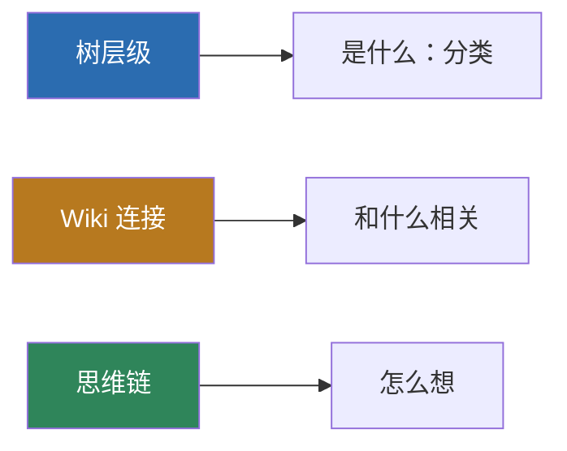

> **设计理念**：*树管"在哪"，Wiki 管"和谁相关"，cot 管"怎么想"*——三者统一在「节点」这一载体上，即 **「节点即一切」**。

### 2. 节点即一切：三类节点

每个 `.md` 文件是一个**知识点节点**，按「是否有思维链、是否有子节点」分为三类：

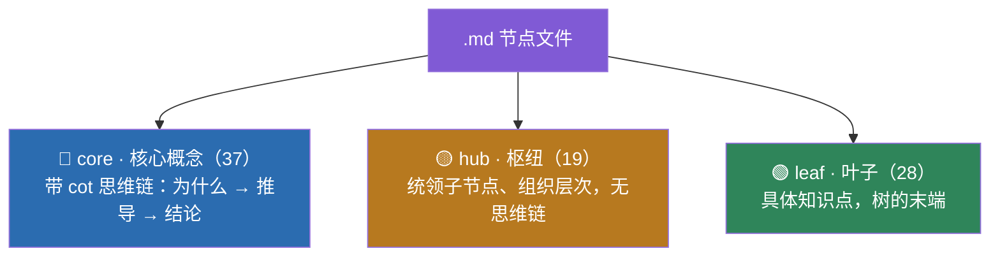

| 类型 | 含义 | 特征 | 数量 |
|------|------|------|:---:|
| `core` | 核心概念 | 带思维链（为什么 → 推导 → 结论） | 37 |
| `hub` | 分类文件夹 | 统领子节点、组织层次，无思维链 | 19 |
| `leaf` | 叶子知识点 | 具体知识点，树的末端 | 28 |

每门课一个**贯穿性枢纽**（写在核心节点里），让每门课有一条清晰的思维主线：

| 课程 | 枢纽 | 主线 |
|------|------|------|
| 通信数学 | 三种思维 | 分解（微积分）/ 变换（线代）/ 不确定性（概统） |
| 通信原理 | 权衡 | 理论极限 vs 工程实现 |
| 信号与系统 + DSP | 对偶对称 | 一个域周期 ↔ 另一个域离散 |
| 移动通信 | 三大矛盾 | 信道 / 频谱 / 移动性的对抗 |
| 随机信号处理 | 维纳-辛钦 | 自相关 ↔ 功率谱 |
| 计算机网络 | 分层 | 封装 / 解封装 |

### 3. 节点的内部结构（frontmatter）

节点用 YAML frontmatter 描述元信息，正文承载知识内容：

| 字段 | 作用 | 示例 |
|------|------|------|
| `id` | 全局唯一标识，前缀表示课程 | `mob-ofdm` |
| `title` | 节点标题 | `OFDM（正交频分复用）` |
| `parent` | 父节点（树的层级） | `mob-anti-fading` |
| `depth` | 树的深度 | `3` |
| `type` | 节点类型 | `core` / `hub` / `leaf` |
| `summary` | 一句话摘要（第一轮检索用） | `高速→N路低速正交子载波…` |
| `links` | Wiki 关联（见第 5 节） | `[{id, relation}, ...]` |
| `cot` | 思维链（core 节点独有） | `{origin, reasoning, conclusion}` |

<details>
<summary>点击展开：完整 core 节点示例（节选自 <code>mob-ofdm.md</code>）</summary>

```yaml
---
id: mob-ofdm
title: OFDM（正交频分复用）
parent: mob-anti-fading
depth: 3
type: core
summary: 高速→N路低速正交子载波+CP循环卷积，把频率选择性变平坦
links:
  - id: dsp-dft-fft
    relation: "OFDM 调制解调用 IFFT/FFT 实现，是 DFT 最成功的工程应用"
  - id: dsp-dft
    relation: "CP 把线性卷积变循环卷积"
  - id: mob-small-scale
    relation: "OFDM 对抗的就是多径导致的频率选择性衰落"
cot:
  origin: "频率选择性衰落导致 ISI，怎么把宽带信道变好对付？"
  reasoning: |
    1. 宽带信号在多径下符号周期短 → 严重 ISI
    2. 串/并转换成 N 路低速子载波，符号周期增大 N 倍
    3. 子载波正交 → 省一半频谱
    4. IFFT/FFT 实现，O(N·logN)
    5. CP > 最大时延扩展，线性卷积变循环卷积
    6. 循环卷积既消 ISI 又保正交
  conclusion: "高速→低速 + 正交 + CP 循环卷积，把频率选择性信道分解成平坦子信道"
---

## 一句话本质
OFDM 把一路高速数据拆成 N 路低速正交子载波，用 CP 把线性卷积变循环卷积，
从而把频率选择性信道分解成若干平坦子信道。

## 核心机制（一条链）
高速流 → 串/并转换 → 子载波正交 → IFFT/FFT → 加 CP → 循环卷积 → 信道对角化

## 关键结论
- 子载波正交 → 频谱重叠但互不干扰 → 比 FDM 省一半频谱
- CP > 最大时延扩展 → 消除 ISI
- CP 用循环卷积不用补零 → 既消 ISI 又保正交（ICI）
```

</details>

### 4. 树层级：七棵主题树

`root` 之下挂七棵主题树，构成课程层次：

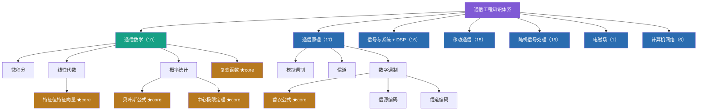

课程层次（通信工程整体框架，反映在树结构中）：

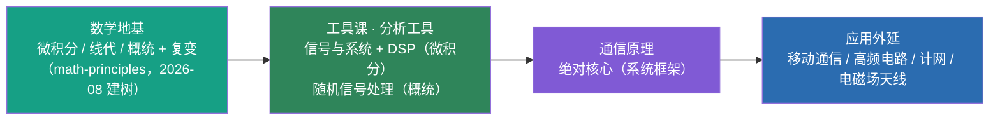

### 5. links（Wiki 连接）设计

树只能表达「上下级」层级关系，但知识之间还有大量**跨层级、跨课程的语义关联**——例如「OFDM 用 FFT 实现」横跨移动通信与 DSP 两棵树。links 用 `relation` 字段做语义化标注，约定六类关系：

| 类型 | 含义 | 示例 |
|------|------|------|
| 应用 | 一个知识是另一个的工程应用 | OFDM ↔ FFT |
| 支撑 | 一个知识是另一个的理论基础 | 最小相位 ↔ 均衡器 |
| 同源 | 本质是同一个概念 | 白噪声 ↔ AWGN |
| 对抗 | 一个技术对抗另一个现象 | OFDM ↔ 频率选择性衰落 |
| 对偶 | 数学上的对偶关系 | 信源编码 ↔ 信道编码 |
| 区分 | 易混概念的区别 | 数据报 ↔ 虚电路 |

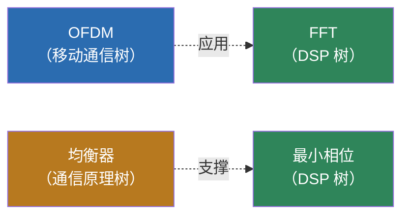

> **关键价值**：links 能救回「关键词完全不重合、但语义强相关」的节点——纯关键词检索匹配不到「均衡器」与「最小相位」的关联，links 沿图一跳即可补上。全库共 **311 条连接，其中 98 条跨树连接**（另有 7 条为 root 到七棵主题树的层级连接）。

### 6. cot（思维链）设计

`core` 节点独有 `cot` 字段，用三段式记录「为什么这样想」：

| 字段 | 作用 |
|------|------|
| `origin` | 问题起点（引出该知识点的原始困惑） |
| `reasoning` | 推理链（分步，每步一个逻辑跃迁） |
| `conclusion` | 结论（收束，提炼核心） |

**为何需要 cot**：让 AI 注入知识时得到「完整推理路径」而非「孤立结论」，从而能**推导出正确的下游结论**。以香农公式节点为例：

```text
origin:   "怎么量化信息量？信道到底能传多少？"
reasoning:
  1. 自信息 I = -log₂P：概率越小越意外、信息量越大
  2. 信息熵 H(X)：信源的平均不确定度
  3. 信道有噪声 → 接收端残留 H(X|Y)（条件熵）
  4. 互信息 I(X;Y) = H(X) - H(X|Y)：真正传过去的信息
  5. 信道容量 = 互信息的最大值；AWGN 下输入取高斯分布时达到
     → 推导出 C = B·log₂(1+S/N)
  6. 对数关系：功率每翻倍（+3dB），容量只 +1 bit/Hz（边际递减）
  7. 带宽与信噪比可互换：深空通信 S/N 极低，用超宽带宽稀释
conclusion: "信道容量是信息论给出的上限；根本限制是噪声"
```

### 7. 结论式写法（内容模板）

本项目最重要的经验——正文采用固定模板，让 AI 扫一眼即可提取答案：

```text
## 一句话本质        ← 第一行即答案核心
## 为什么需要它      ← 解决什么问题
## 核心机制（一条链）  ← 用 → 箭头串成推理路径
## 关键结论          ← 结论式写法，直接可抄
## 代价与权衡        ← 呼应全库「权衡」枢纽
```

> [!TIP]
> 这一写法后来被 benchmark 验证为**最大的隐性贡献因素**：仅靠朴素 TF-IDF 关键词检索已能覆盖约 90% 的关联，远超结构设计带来的增量。

---

## 🔍 检索方案研究

### 1. 检索流程

最终方案为四阶段流水线：


### 2. 检索方案演进史

从「模型自主选」到「top-3 + links + 精挑」，共迭代 6 种方案（A~F，详见 [docs/06-项目归档总结.md](docs/06-项目归档总结.md) 6.1），下表按演进阶段归纳：

| 阶段 | 方案 | 核心思想 | 结论 |
|:---:|------|---------|------|
| 1 | 模型自主选 | LLM 看完整目录自己挑节点 | 淘汰：弱模型选不准、慢且贵 |
| 2 | 纯 TF-IDF | 程序关键词匹配，不依赖模型 | 淘汰：无模型参与，召回最低 |
| 3 | 程序初筛 + 模型精挑 | 程序缩小范围，模型精挑 | ✅ 保留：核心框架，唯一大收益 |
| 4 | 结构变体 | 排除 hub / links 扩展 | 微调：差异在噪声内 |
| 5 | top-3 + links + 精挑 | 收窄初筛，links 补回 | ✅ 采用：最终方案 |

> **关键转折**：第 3 阶段的「程序初筛 + 模型精挑」框架贡献了全部主要收益；links 扩展、排除 hub 均属理论正确但增量有限的微调。

### 3. links 研究的诚实结论

对 links 做了多轮严格验证，结论经历了「误判 → 探索 → 真相」的完整迭代：

| 阶段 | 当时的结论 | 修正 |
|------|-----------|------|
| 误判 | links 选节点扩展零收益 | 建立在「top-8/10 已够宽」的隐含前提上 |
| 探索 | links 该用于「注入」环节 | 但注入膨胀 3 倍，性价比低 |
| 真相 | ✅ links 价值取决于 top-K 宽度 | top-K 越窄，links 救回的正确答案越多 |

> **最终发现**：links 的价值随 top-K 收窄而增大——top-K 越窄，初筛漏掉的正确答案越多，而这些漏掉的节点恰好是 links 邻居能救回的。

### 4. top-K 扫描

对 top-K = 2~5 做纯程序覆盖扫描，定位甜点：

| top-K | 纯 TF-IDF | +links 扩展 | 平均候选 |
|:---:|:---:|:---:|:---:|
| 2 | 78% | 96% | 6.9 |
| **3** | 86% | **97%** | **9.3** |
| 4 | 91% | 99% | 11.8 |
| 5 | 92% | 99% | 14.3 |

> **top-3 为甜点**：候选覆盖率 97%，候选仅 9.3 个（比朴素 top-10 更省），精挑不过载。注：本表为**纯程序覆盖扫描**口径（衡量初筛候选是否包含正确答案）；加入 LLM 精挑后的最终召回率见 [评测体系 → 检索方案对比](#3-评测结果)。

---

## 🧪 评测体系

### 1. benchmark 设计（116 题完整题库）

题库按两个维度分层，合并全部历史题库（6 个版本去重 + 修正标注）：

| 维度 | 分类 | 题数 | 考察目标 |
|------|------|:---:|------|
| 难度层级 | L3 单科 | 55 | 单一门课的知识点 |
| | L4 跨学科 | 61 | 跨树 / 跨课程的串联 |
| 题型 | 常规题 | 86 | 标准知识点 |
| | 难题（相似概念 / 多节点） | 15 | 选节点容易错 |
| | 反直觉题 | 15 | 深层机制理解 |

> **设计意图**：L3 测「单点选得准不准」，L4 测「跨树关联找不找得到」——难题与反直觉题的正确答案 TF-IDF 排名靠后，正是 links 扩展发挥价值之处。注：题型分类沿用历史题库合并时的标注（题库文件内未单列题型字段，反直觉题以 `H-` 前缀可识别）。

### 2. 评测方法

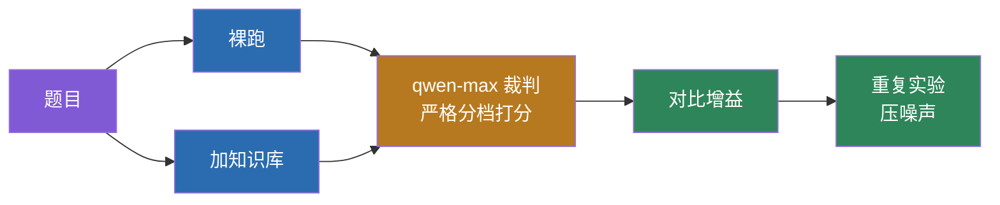

1. **多模型对照**：DeepSeek + Qwen3（8B/14B/32B）+ GLM-5.2，覆盖 8B 到大模型全档
2. **裸跑 vs 加知识库**：同一题跑两遍，仅改变「是否注入知识库」
3. **裁判模型打分**：qwen-max 按严格分档（关键错误重扣、漏要点扣分）
4. **重复实验压噪声**：早期对关键结论重复 3 次，识别精挑的 ±1~2 点随机噪声；2026-08-22 全量重跑为单轮全量（同轮同裁判保证裸跑与加知识库可比，见「评测可信度」）
5. **数据清洗**：修正题库混入的分类节点标注、重复题目 id 等问题

### 3. 评测结果

**检索方案对比（116 题完整 benchmark，完整流水线口径：初筛 → links 扩展 → LLM 精挑后，最终引用节点是否命中正确答案）**：

| 方案 | 最终召回率 | 平均候选 |
|------|:---:|:---:|
| 纯 top-10 + LLM（基线） | 74.3% | 10.0 |
| **top-3 + links + LLM（采用）** | **79.1%** | **9.8** |
| top-4 + links + LLM | 80.1% | 12.3 |

> 注：本表口径与「检索方案研究 → top-K 扫描」的纯程序候选覆盖率不同（后者不经过 LLM 精挑），两表不可直接横向比较。

**模型增益（116 题全量重跑，method F，裸跑 vs 加知识库）**：

| 模型 | 116 题整体增益 | 反直觉子集增益 |
|------|:---:|:---:|
| Qwen3-14B | +0.698 | +1.067 |
| Qwen3-8B | +0.569 | +0.667 |
| DeepSeek | +0.467 | +0.800 |
| Qwen3-32B | +0.427 | +0.533 |
| GLM-5.2 | +0.319 | +0.467 |

> 2026-08-22 全量重跑数据（此前 8B/GLM 裸跑缺失已补齐）；评分口径详见顶部「核心结果」与「评测可信度」。

**关键结论**：

- ✅ 知识库对**全部 5 档模型均为正增益**，无模型被拖累
- 📈 **小档模型增益更大**（14B +0.698 / 8B +0.569 > 32B +0.427 / GLM +0.319），与「模型越大增益越大」的常见直觉相反
- 🎯 在反直觉难题（严格裁判）上，增益进一步放大至 **+1.067**（14B），验证「题目越难、知识库价值越大」

---

## 📁 项目结构

```text
knowledge-base/
├── knowledge-v2/            # 知识库本体（核心）
│   ├── nodes/               # 84 个 .md 节点（每个 = 一个知识点）
│   └── _meta/tree.json      # 树结构索引（build_tree.py 自动生成）
├── benchmark/               # 评测体系
│   ├── questions_full.json  # 116 题完整题库
│   ├── questions_fuzzy.json # 20 道模糊大问题专项 benchmark（fuzzy_hub_rag 用）
│   ├── multiturn_questions.json  # 44 组多轮追问题库
│   ├── 评测报告_*.html      # 可视化评测报告
│   └── results/             # 评测原始数据（jsonl）
├── tools/                   # 工具脚本
│   ├── kb_benchmark.py      # 评测主脚本（多模型 × 裁判打分，最终方案 select_nodes_final）
│   ├── eval_followup.py     # 多轮追问评测（baseline vs 插件）
│   ├── multiturn_rag/
│   │   └── followup_rag.py  # 多轮追问记忆插件（FollowupRAG + Session）
│   ├── fuzzy_hub_rag/       # 模糊大问题粗粒度匹配（benchmark + 5 策略 + 实验报告）
│   ├── update_readme_stats.py  # 自动同步 README 知识库统计
│   ├── build_tree.py        # 生成树结构索引
│   ├── kb_lint.py           # 知识库完整性校验
│   └── archive/             # 历史实验脚本/题库（归档，仅供参考）
├── review/                  # 复习出题插件（Streamlit，只读知识库）
└── docs/                    # 设计文档（01-07）
```

---

## 🚀 快速开始

```bash
# 0. 安装依赖（LLM 调用 + YAML 解析）
pip install -r tools/requirements.txt

# 1. 校验知识库完整性
python tools/kb_lint.py

# 2. 生成树结构索引（新增/修改节点后）
python tools/build_tree.py

# 3. 同步 README 知识库统计（新增/删除节点后）
python tools/update_readme_stats.py

# 4. 跑单轮评测（需配置 API key，见 tools/.env.example）
python tools/kb_benchmark.py --limit 5   # 先跑 5 题测试；全量去掉 --limit

# 5. 跑多轮追问评测（对比 baseline vs 插件）
python tools/eval_followup.py --limit 5
```

---

## 🧩 复习出题插件

基于本知识库的 AI 复习出题插件（目录 `review/`，Streamlit Web）。**只读知识库、不修改树结构**，题目与学习记录独立存储。

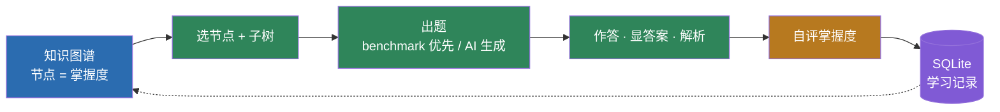

**两大模块：**

- **🎯 定向出题**：渲染全知识图谱（节点颜色 = 掌握度）；选任意节点自动学习其及所有子节点；优先 benchmark 题库（116 题），答完可 AI 生成简答 / 判断 / 填空；答案解析只引用节点原文。
- **📊 学习状态记录**：掌握度五档 + 做题数；无记录 = 灰、薄弱难点 = 红、其余橙 → 黄 → 绿渐变；本地 SQLite 存储，可按节点查历史。

```bash
cd review
pip install -r requirements.txt
cp .env.example .env        # 填入 DEEPSEEK_API_KEY（或 SILICONFLOW_API_KEY）
streamlit run app.py
```

> [!WARNING]
> 当前为**初版（MVP）**：选节点靠下拉框（暂不支持点击图谱直接选中）、判断题/填空题只能 AI 生成、暂无追问/题目编辑/导入导出。Phase 2 规划：单题追问、题目编辑与导入导出、难度自适应、点击图谱直接选节点。

---

## 💬 多轮追问提升

单轮检索每次独立、不携带上一轮上下文；真实问答中用户会连续追问，尤其**裸指代追问**（"那反过来呢""补零呢"）几乎不含信息词，独立检索必然失焦。本项目在既有检索流水线上实现**追问记忆**，并用 44 组 / 156 轮追问题库实测验证。

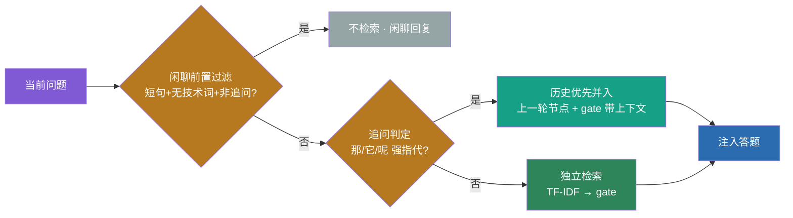

> 分档口径：**D1** 裸指代（"那反过来呢"，≤8 字强依赖）· **D2** 短追问 · **D3** 中等 · **D4** 长自包含（>25 字）· **D5** 新话题（负例）· **chitchat** 闲聊（负例）。完整定义见 [docs/07-多轮追问技术报告.md](docs/07-多轮追问技术报告.md)。

### 两个核心结论

**① 追问记忆对裸指代（D1）追问有效**——31 条 D1 实测：baseline 42% → 插件 71%，**提升 29 个百分点**；追问档（D1~D4 合并）合计 +9.8 个百分点。D2/D3/D4 基线本就高（天花板效应），增益小是正常。

**② 误判代价不对称 → 判定可放宽**——追问漏判低代价（用户重问一次）；新话题误判追问实测无害（历史是候选增强，gate 仍选对新话题节点）；**闲聊误检必须严格，实测误检率 0**（前置过滤已关死）。故追问判定"宁松勿错"、闲聊判定"宁严勿漏"。

> [!IMPORTANT]
> **踩坑记录**：曾尝试"信号 + 与上轮余弦确认"的复合方法，实测净增益从 +9.8 个百分点掉到 +2.0 个百分点——D1 裸指代与上轮词面本就不重合，余弦确认误杀真追问。**最终只凭强指代信号带历史，不做余弦确认。**

### 文件

| 文件 | 说明 |
|:---|:---|
| `benchmark/multiturn_questions.json` | 追问题库（44 组 / 156 轮，分档 + expected_nodes） |
| `tools/multiturn_rag/followup_rag.py` | 追问记忆插件（`FollowupRAG` 判定 + `Session` 状态，依赖注入可对接线上） |
| `tools/eval_followup.py` | 评测脚本（baseline vs 插件，分档指标，可跑多变体对比） |
| `benchmark/README_multiturn.md` | 完整评测说明与 v1.0→v1.4 演进记录 |
| `docs/07-多轮追问技术报告.md` | 技术报告（两个核心结论 + 取舍） |

---

## 🔀 模糊大问题粗粒度匹配（fuzzy_hub_rag）

模糊宽泛大问题（"移动通信都有哪些关键技术？"）直接命中具体知识点会失焦——本插件在检索入口前做**大小问题路由**：模糊大问题 → 命中 hub 枝干节点，注入「主题域总览 + 统领子主题列表」，AI 输出总览框架 + 分支列举 + 引导追问；用户追问分支时由追问记忆插件承接，落到具体 leaf/core 精细回答——**先给地图、追问再钻到街道**。独立开关，不影响正常精确检索路径。

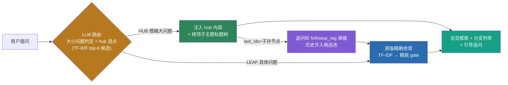

**benchmark-first 定案**（专项 benchmark：20 模糊题 + 116 题库抽 20 对照组，完整技术报告见 [docs/08-模糊大问题粗粒度匹配技术报告.md](docs/08-模糊大问题粗粒度匹配技术报告.md)，过程时间线见 [tools/fuzzy_hub_rag/README.md](tools/fuzzy_hub_rag/README.md)）：

- **S5 全 LLM 判定胜出**：大小点分类 A=97.5%（40 题错 1），对照组 20/20 零误判，hub 选点 hit@2=90%；纯 TF-IDF 分流漏 8/20 大问题（recall 60%）是 S1-S4 共同瓶颈——TF-IDF 只配做粗筛（候选 k=6 即 100% 召回），不配做精选。
- **线上形态**：路由清单 = TF-IDF top-6 候选（输入省 ~69%，`fuzzy_hub_candidate_k` 可调/可回退全量）；每 RAG 问题 +1 次 LLM 调用（~1000 token），HUB 命中后跳过精挑 gate；LLM 失败自动降级走原路径。
- **root 是合法选点**：极泛问题（"这个知识库都有哪些内容"）的正确 hub 就是 root，不排除。

### 文件

| 文件 | 说明 |
|:---|:---|
| `tools/fuzzy_hub_rag/README.md` | 完整实验报告（过程时间线 + 5 策略对比 + 补充实验 + 复现） |
| `benchmark/questions_fuzzy.json` | 20 道模糊题专项 benchmark（expected_hubs 经 3 轮标注 + 人工复核，独立于 116 题库） |
| `tools/fuzzy_hub_rag/strategies/` | S1-S5 五个可插拔路由策略（含判定 prompt v2） |
| `tools/fuzzy_hub_rag/fuzzy_benchmark.py` | 评测框架（Part A 分类准确率 / Part B 选点命中 / 调用成本） |
| `tools/fuzzy_hub_rag/experiment_combined.py` | 补充实验：TF-IDF top-k 粗筛 + LLM 选点（k=4~8） |
| `tools/fuzzy_hub_rag/verify_online.py` | 线上实现本地端到端验证脚本 |
| 线上实现 | `src/plugins/ai_chat/fuzzy_hub_rag.py` + `node_retriever.py` hook（`fuzzy_hub_enabled` 开关） |

---

## 📄 设计文档

| 文档 | 内容 |
|------|------|
| `docs/01-设计总纲.md` ~ `05-任务清单.md` | 设计阶段的方法论与规划 |
| `docs/06-项目归档总结.md` | 全部实验数据、踩坑记录与核心洞察 |
| `docs/07-多轮追问技术报告.md` | 多轮追问提升：两个核心结论 + 关键取舍 |
| `docs/08-模糊大问题粗粒度匹配技术报告.md` | 模糊大问题路由：benchmark-first 定案（S5 胜出）+ 关键取舍 |
| `benchmark/评测报告_*.html` | 可视化报告（时间线、方案演进、完整实验史） |

---

## 📜 License

本项目采用 [MIT License](LICENSE)。
