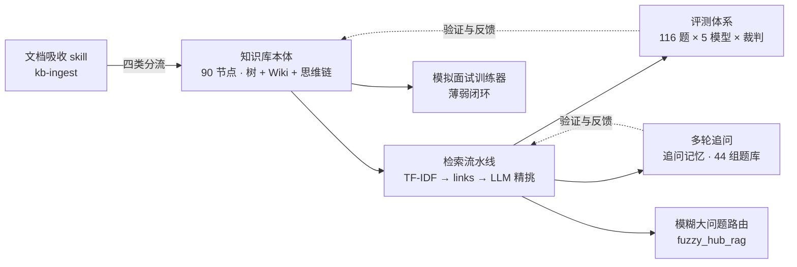
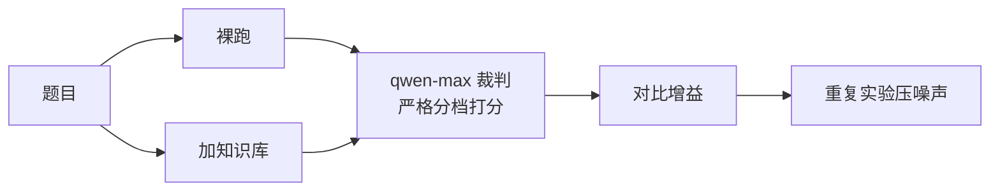
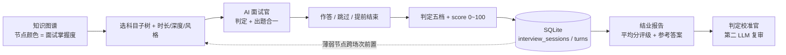
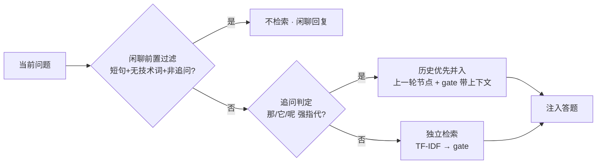
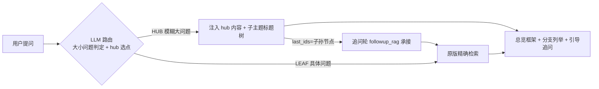
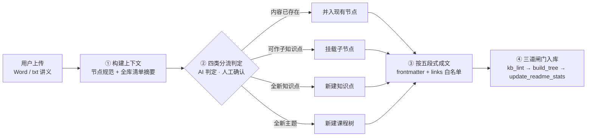

<div align="center">

# 通信工程知识库

**Communication Knowledge Base v2** — 面向专业知识问答的 RAG 知识图谱

<p align="center">
  
  
  
  
  
  
  
</p>

</div>

> **摘要**　本项目研究「如何用外部知识库增强大语言模型的专业问答能力」，以通信工程七门课程为对象，把课程知识组织为「节点 + 树层级 + Wiki 关联 + 思维链」三层结构（90 节点 / 340 条连接 / 39 条思维链），并配套一套可复现的多模型评测体系。在 116 题 benchmark 上，最终检索方案（top-3 + links 扩展 + LLM 精挑）对 5 个模型（8B ~ 大模型）**全部为正增益**，同题配对 t 检验全部 p < 0.01；进一步实现了多轮追问记忆（裸指代追问正确率 42% → 71%）与面向模糊大问题的大小点路由。
>
> **关键词**　检索增强生成；知识图谱；专业知识问答；多模型评测；思维链

## 目录

**研究** · [1 研究动机](#1-研究动机) · [2 项目全景](#2-项目全景) · [3 核心结果](#3-核心结果)

**复现** · [4 快速开始](#4-快速开始)

**方法与设计** · [5 知识库设计](#5-知识库设计) · [6 检索方案](#6-检索方案) · [7 评测体系](#7-评测体系)

**应用** · [8 模拟面试训练器](#8-模拟面试训练器review) · [9 多轮追问](#9-多轮追问) · [10 模糊大问题路由](#10-模糊大问题路由fuzzy_hub_rag) · [11 文档吸收](#11-文档吸收kb-ingest)

**参考** · [12 项目结构](#12-项目结构) · [13 设计文档](#13-设计文档) · [14 许可](#14-许可)

---

## 1 研究动机

大语言模型回答专业课程问题时存在明显短板：对通信原理、信号处理这类需要精确概念与推理的领域，常出现**概念混淆、要点遗漏**，甚至被「反直觉陷阱题」带偏。

> **典型陷阱**　「DSB 与 SSB 的抗噪性能是否相同？」——公平比较下两者相同，但大量资料误传「SSB 更优 3dB」。早期实测中，多个 7B~32B 档中小模型均答错，因其训练语料混入了错误答案。

本项目要回答的核心问题是：**如何用外部知识库增强大语言模型的专业问答能力？** 该问题可拆为三个子问题：

| 子问题 | 工作内容 |
|:---|:---|
| 知识如何**表示** | 设计「节点 + 树 + Wiki 关联 + 思维链」三层知识图谱结构 |
| 知识如何**检索** | 系统对比 6 种检索方案，重复实验压噪声，得到稳定结论 |
| 效果如何**评测** | 搭建多模型 benchmark（5 档规模 × 裸跑/加知识库 × 严格裁判） |

---

## 2 项目全景



---

## 3 核心结果

在 116 题完整 benchmark 上，采用最终检索方案（method F：top-3 + links 扩展 + LLM 精挑），知识库对**全部 5 个模型均为正增益**，且小档模型（8B/14B）的相对提升高于大档模型——与「模型越大、知识库增益越大」的常见直觉相反。

| 模型 | 规模 | 裸跑 | 加知识库 | 增益 | 反直觉子集增益 | 相对提升 |
|------|:---:|:---:|:---:|:---:|:---:|:---:|
| Qwen3-14B | 14B | 7.319 | 8.017 | **+0.698** | **+1.067** | **+9.54%** |
| Qwen3-8B | 8B | 7.043 | 7.612 | +0.569 | +0.667 | +8.07% |
| DeepSeek | 大模型 | 7.809 | 8.276 | +0.467 | +0.800 | +5.98% |
| Qwen3-32B | 32B | 7.496 | 7.922 | +0.427 | +0.533 | +5.69% |
| GLM-5.2 | 大模型 | 7.707 | 8.026 | +0.319 | +0.467 | +4.14% |

<p align="center">
  
</p>

> **图 1**　五个模型的裸跑与加知识库得分（116 题 · method F · 2026-08-22 全量重跑，按裸跑分数降序）。灰点 = 裸跑，蓝点 = 加知识库，横轴为 qwen-max 裁判均分（0–10 分，自 6.5 起）；误差线 = 同题配对差值 95% CI，配对 t 检验全部 p < 0.01（t = 3.2–6.0），下界均大于 0。分值点为各臂有效样本均值，误差线为同题配对口径：Qwen3-8B / Qwen3-32B / DeepSeek 各有 1 题裸跑调用失败被剔除（配对 n = 115），其余模型为 116。详细口径与稳健性检查见 [7.4 评测可信度](#74-评测可信度)。

三条一致规律：

1. 全部 5 个模型均为正增益，无模型被拖累；
2. **反直觉难题子集增益 > 整体增益**（14B 达 +1.067）——题目越难，知识库价值越大；
3. **小档模型相对提升 > 大档模型**——模型规模越小越依赖外部知识（两档内非严格单调，14B 略高于 8B）。

多轮追问（44 组 / 156 轮）：追问记忆使**裸指代追问正确率提升 29 个百分点**（42% → 71%），闲聊误检率 0，详见 [9 多轮追问](#9-多轮追问)。

---

## 4 快速开始

```bash
# 0. 安装依赖（LLM 调用 + YAML 解析）
pip install -r tools/requirements.txt

# 1. 校验知识库完整性
python tools/kb_lint.py

# 2. 生成树结构索引（新增/修改节点后）
python tools/build_tree.py

# 3. 同步本文件的统计数字与徽章（新增/删除节点后）
python tools/update_readme_stats.py

# 4. 跑单轮评测（需配置 API key，见 tools/.env.example）
python tools/kb_benchmark.py --limit 5   # 先跑 5 题测试；全量去掉 --limit

# 5. 跑多轮追问评测（对比 baseline 与插件）
python tools/eval_followup.py --limit 5
```

### 4.1 运行模拟面试训练器（3 步）

```bash
cd review
pip install -r requirements.txt          # 依赖极少：streamlit + openai + python-dotenv
streamlit run app.py                     # 浏览器自动打开 http://localhost:8501
```

打开页面后：左侧栏「API 配置」粘贴 Key（DeepSeek / SiliconFlow 均可，仅存本地 `review/.env`，不提交）→ 选科目、时长、深度、风格 → 开始面试 → 逐轮作答看判定，结束后查看结业报告。

> review 应用自包含（`review/` 单独拷走即可运行，只读 `knowledge-v2/nodes` 节点数据）；界面、调用成本与数据模型详见 [review/README.md](review/README.md)。

---

## 5 知识库设计

### 5.1 三种结构回答三个问题

知识组织本质要回答三个问题——**这是什么、和什么相关、该怎么想**：

| 结构 | 回答的问题 |
|------|-----------|
| 树层级 | **是什么**——分类（树的层级） |
| Wiki 连接 | **和什么相关**——links 语义关联 |
| 思维链（cot） | **怎么想**——推理路径 |

设计理念：**树管「在哪」，Wiki 管「和谁相关」，cot 管「怎么想」**——三者统一在「节点」这一载体上，即**节点即一切**。

### 5.2 三类节点

每个 `.md` 文件是一个知识点节点：

| 类型 | 含义 | 特征 | 数量 |
|------|------|------|:---:|
| `core` | 核心概念 | 带思维链（为什么 → 推导 → 结论） | 39 |
| `hub` | 分类枢纽 | 统领子节点、组织层次，无思维链 | 20 |
| `leaf` | 叶子知识点 | 具体知识点，树的末端 | 31 |

frontmatter 承载元信息，正文承载知识：

<details>
<summary><b>查看完整节点示例（frontmatter + links + cot）</b></summary>

```yaml
---
id: mob-ofdm
title: OFDM（正交频分复用）
parent: mob-anti-fading
depth: 3
type: core
summary: 高速→N路低速正交子载波+CP循环卷积，把频率选择性变平坦
links:
  - id: dsp-dft-fft
    relation: "OFDM 调制解调用 IFFT/FFT 实现，是 DFT 最成功的工程应用"
  - id: mob-small-scale
    relation: "OFDM 对抗的就是多径导致的频率选择性衰落"
cot:
  origin: "频率选择性衰落导致 ISI，怎么把宽带信道变好对付？"
  reasoning: |
    1. 串/并转换成 N 路低速子载波，符号周期增大 N 倍
    2. 子载波正交 → 省一半频谱；IFFT/FFT 实现 O(N·logN)
    3. CP > 最大时延扩展 → 线性卷积变循环卷积，既消 ISI 又保正交
  conclusion: "高速→低速 + 正交 + CP 循环卷积，把频率选择性信道分解成平坦子信道"
---
```

</details>

### 5.3 树层级：七棵主题树

`root` 之下挂七棵主题树。每门课有一个**贯穿性枢纽**（写在核心节点里）提供思维主线：

| 课程 | 节点数 | 枢纽 | 主线 |
|------|:---:|------|------|
| 通信数学 | 10 | 三种思维 | 分解（微积分）/ 变换（线代）/ 不确定性（概统） |
| 通信原理 | 17 | 权衡 | 理论极限 vs 工程实现 |
| 信号与系统 + DSP | 16 | 对偶对称 | 一个域周期 ↔ 另一个域离散 |
| 移动通信 | 18 | 三大矛盾 | 信道 / 频谱 / 移动性的对抗 |
| 随机信号处理 | 15 | 维纳-辛钦 | 自相关 ↔ 功率谱 |
| 电磁场 | 6 | 麦克斯韦方程 | 方程 → 电磁波 → 天线辐射（信号载体来源） |
| 计算机网络 | 7 | 分层 | 封装 / 解封装 |

### 5.4 links（Wiki 连接）

树只能表达上下级，但知识间大量存在跨层、跨课的语义关联（OFDM 用 FFT 实现，横跨两棵树）。links 用 `relation` 字段标注六类关系：

| 类型 | 含义 | 示例 |
|------|------|------|
| 应用 | 一个知识是另一个的工程应用 | OFDM ↔ FFT |
| 支撑 | 一个知识是另一个的理论基础 | 最小相位 ↔ 均衡器 |
| 同源 | 本质是同一个概念 | 白噪声 ↔ AWGN |
| 对抗 | 一个技术对抗另一个现象 | OFDM ↔ 频率选择性衰落 |
| 对偶 | 数学上的对偶关系 | 信源编码 ↔ 信道编码 |
| 区分 | 易混概念的区别 | 数据报 ↔ 虚电路 |

**关键价值**：links 能救回「关键词完全不重合、但语义强相关」的节点——纯关键词检索匹配不到「均衡器」与「最小相位」，links 沿图一跳即可补上。全库 340 条连接中 **119 条跨树**。

### 5.5 cot（思维链）

`core` 节点用三段式记录「为什么这样想」：`origin`（问题起点）→ `reasoning`（分步推理链）→ `conclusion`（结论收束），使模型注入时得到完整推理路径而非孤立结论。以香农公式节点为例的推理链终点：

$$
C = B \cdot \log_2\left(1 + \frac{S}{N}\right)
$$

对数关系意味着功率每翻倍（+3dB）容量仅 +1 bit/Hz（边际递减），由此推出「带宽与信噪比可互换」：深空通信 S/N 极低，就用超宽带宽稀释。

### 5.6 内容模板（结论式写法）

本项目最重要的经验——正文采用固定五段式，模型扫一眼即可提取答案：

```text
## 一句话本质        ← 第一行即答案核心
## 为什么需要它      ← 解决什么问题
## 核心机制（一条链）  ← 用 → 箭头串成推理路径
## 关键结论          ← 结论式写法，直接可抄
## 代价与权衡        ← 呼应全库「权衡」枢纽
```

> **经验结论**　该写法被 benchmark 验证为最大的隐性贡献因素：仅靠朴素 TF-IDF 已能覆盖约 90% 的关联，远超结构设计带来的增量——**内容质量 > 结构复杂度**。

---

## 6 检索方案

### 6.1 最终流水线


### 6.2 方案演进（6 种方案 A~F）

| 阶段 | 方案 | 核心思想 | 结论 |
|:---:|------|---------|------|
| 1 | 模型自主选 | LLM 看完整目录自己挑节点 | 淘汰：弱模型选不准、慢且贵 |
| 2 | 纯 TF-IDF | 程序关键词匹配 | 淘汰：无模型参与，召回最低 |
| 3 | 程序初筛 + 模型精挑 | 程序缩小范围，模型精挑 | 保留：核心框架，唯一大收益 |
| 4 | 结构变体 | 排除 hub / links 扩展 | 微调：差异在噪声内 |
| 5 | top-3 + links + 精挑 | 收窄初筛，links 补回 | **采用：最终方案（method F）** |

**关键转折**：第 3 阶段的「程序初筛 + 模型精挑」贡献了全部主要收益；links 扩展与排除 hub 均属理论正确、但增量有限的微调。

### 6.3 links 价值的研究结论

对 links 做了多轮严格验证，结论经历「误判 → 探索 → 真相」的完整迭代：

| 阶段 | 当时的结论 | 修正 |
|------|-----------|------|
| 误判 | links 扩展零收益 | 建立在「top-8/10 已够宽」的隐含前提上 |
| 探索 | links 该用于注入环节 | 注入膨胀 3 倍，性价比低 |
| 真相 | **links 价值取决于 top-K 宽度** | top-K 越窄，初筛漏掉的正确答案越多，恰是 links 邻居能救回的 |

### 6.4 top-K 扫描

对 top-K = 2~5 做纯程序覆盖扫描（衡量初筛候选是否含正确答案，不含 LLM 精挑）：

| top-K | 纯 TF-IDF | +links 扩展 | 平均候选数 |
|:---:|:---:|:---:|:---:|
| 2 | 78% | 96% | 6.9 |
| **3** | 86% | **97%** | **9.3** |
| 4 | 91% | 99% | 11.8 |
| 5 | 92% | 99% | 14.3 |

**top-3 为甜点**：候选覆盖率 97%，平均仅 9.3 个候选，精挑阶段不过载。

---

## 7 评测体系

### 7.1 benchmark 设计（116 题）

| 维度 | 分类 | 题数 | 考察目标 |
|------|------|:---:|------|
| 难度 | L3 单科 | 55 | 单门课的知识点命中 |
| | L4 跨学科 | 61 | 跨树 / 跨课程的串联 |
| 题型 | 常规题 | 86 | 标准知识点 |
| | 难题（相似概念/多节点） | 15 | 选节点容易错 |
| | 反直觉题 | 15 | 深层机制理解 |

设计意图：L3 测「单点选得准不准」，L4 测「跨树关联找不找得到」；难题与反直觉题的正确答案在 TF-IDF 中排名靠后，正是 links 扩展发挥价值之处。

### 7.2 评测方法



1. **多模型对照**：DeepSeek + Qwen3（8B/14B/32B）+ GLM-5.2，覆盖 8B 到大模型全档；
2. **裸跑与加知识库**：同一题跑两遍，仅改变是否注入知识库；
3. **裁判打分**：qwen-max 按标准答案打 0–10 分（正确度 / 完整度 / 逻辑性），温度 0；
4. **重复压噪声**：早期关键结论重复 3 次以识别裁判 ±1~2 分的随机噪声；2026-08-22 起全量单轮重跑（同轮同裁判，保证裸跑与加知识库可比）；
5. **测量卫生**：选点失败标记 `degraded`，不冒充加知识库成绩；API 失败不打分并以 -1 剔除；裁判输出做类型校验。

### 7.3 检索方案对比（最终召回率）

完整流水线口径（初筛 → links 扩展 → LLM 精挑后，最终引用节点是否命中正确答案）：

| 方案 | 最终召回率 | 平均候选 |
|------|:---:|:---:|
| 纯 top-10 + LLM（基线） | 74.3% | 10.0 |
| **top-3 + links + LLM（采用）** | **79.1%** | **9.8** |
| top-4 + links + LLM | 80.1% | 12.3 |

> 数据来自 2026-08-16 的方案选型实验（完整过程见 [docs/06-项目归档总结.md](docs/06-项目归档总结.md)）。本表口径与 6.4 节「top-K 扫描」的纯程序覆盖率不同（后者不经过 LLM 精挑），两者不可直接横向比较。

### 7.4 评测可信度

**评分机制**（裁判按标准答案打分）：

<p align="center">
  
</p>

> **图 2**　裁判评分档位（qwen-max，温度 0，0–10 分）。分数 = 正确度打底（编造内容 ≤ 2 分；概念 / 结论 / 原理错误 ≤ 4 分）→ 完整度逐点累计（每漏一个核心要点 −2 分）→ 逻辑性决定能否突破 6 分上限（只答表面规律 ≤ 6 分，答出深层机制 9–10 分）。

- **长度偏见检查**：用本轮数据实测排除「裁判看长度给分」——Qwen3-14B 加知识库后答案反而更短（683 → 628 字符）却得分更高；DeepSeek 长度几乎不变（706 → 694）而分数提升。两者均排除长度骗分。
- **提升模式**：反直觉 15 题逐题对比，增益是「多点小提升」（+1~+2 为主）而非个别题暴涨，说明帮助均匀可复现。
- **同轮同裁判**：裸跑与加知识库在同一轮、同一裁判下打分，杜绝跨轮裁判波动（实测跨轮裸跑基线有 ±0.5 自然波动，故只承认轮内增益）。
- **配对显著性**：对 116 题做同题配对 t 检验，5 个模型增益**全部 p < 0.01**（t = 3.2~6.0），配对差值 95% CI 下界均大于 0，增益不是裁判噪声（其中 3 个模型各有 1 题裸跑调用失败被剔除，配对 n = 115）。

**已知局限**：反直觉子集仅 15 题，均值受单题裁判波动影响（±0.3 属正常）；qwen-max 温度 0 但非严格确定，跨轮次分数不完全可比；题库覆盖五门课，对领域外泛化未验证。

---

## 8 模拟面试训练器（review）

基于知识库的 Streamlit Web 应用，用于模拟研究生复试的专业课面试：面试官沿所选科目子树出题，**每轮一次 LLM 调用 = 判定上一答 + 出下一题**，答对才往深追、答错下探基础，过程不泄露对错，结束后给出结业报告。



核心能力：

- **判定纪律**：只依据本轮注入的节点原文判定（防模型外推幻觉），口语化讲对要点即判为答对；五档判定 + 0~100 连续分 + 每题参考答案对照；
- **跨场次薄弱闭环**：开场自动聚合历史答错或未答上的节点优先复测（「曾在 XX 知识点答错 N 次」注入面试官）；
- **判定校准官**：结束后可发起第二个 LLM 严格复审（逐题改判建议 + 考生画像 + 复习计划），每场仅 +1 次调用且带缓存；
- **知识图谱联动**：节点颜色 = f(面试历史)，红 = 薄弱难点，灰 = 未面到。

运行方式与 Key 安全详见 [review/README.md](review/README.md)。`.env` 已被 .gitignore 排除、永不提交，页面只回显掩码。

---

## 9 多轮追问

单轮检索每次独立、不携带上一轮上下文，真实问答中的**裸指代追问**（「那反过来呢」「补零呢」）几乎不含信息词，独立检索必然失焦。本项目在检索流水线上实现追问记忆，并用 44 组 / 156 轮追问题库实测验证。



**两个核心结论**：

1. **追问记忆对裸指代（D1）有效**：31 条 D1 实测 baseline 42% → 插件 71%（**+29 个百分点**）；追问档 D1~D4 合计 +9.8pp。D2/D3/D4 基线本就高（天花板效应），增益小属正常；
2. **误判代价不对称，因此判定可放宽**：追问漏判代价低（用户重问一次即可）；新话题被误判为追问实测无害（历史节点仅作候选增强，gate 仍能选对新节点）；但**闲聊误检必须严格，实测误检率 0**。

> **设计取舍**　曾尝试「强指代信号 + 与上轮余弦确认」的复合方法，净增益从 +9.8pp 降到 +2.0pp——D1 裸指代与上轮词面本就不重合，余弦确认会误杀真追问。**最终只凭强指代信号带历史，不做余弦确认。**

分档口径（D1 裸指代 ≤8 字强依赖 / D2 短追问 / D3 中等 / D4 长自包含 / D5 新话题负例 / chitchat 闲聊负例）与完整报告见 [docs/07-多轮追问技术报告.md](docs/07-多轮追问技术报告.md)。

---

## 10 模糊大问题路由（fuzzy_hub_rag）

模糊宽泛的大问题（「移动通信都有哪些关键技术？」）若直接命中具体知识点会失焦。本插件在检索入口前做**大小问题路由**：模糊大问题 → 命中 hub 枝干节点，注入「主题域总览 + 统领子主题列表」；用户追问分支时由追问记忆插件承接，落到 leaf/core 精细回答——**先给地图，追问再钻到街道**。



**benchmark-first 定案**：S5（全 LLM 判定）胜出——大小点分类 A = 97.5%、对照组 20/20 零误判、hub 选点 hit@2 = 90%；纯 TF-IDF 分流漏掉 8/20 大问题，是 S1–S4 的共同瓶颈，说明 TF-IDF 只适合做粗筛、不适合做精选。

> **数据状态（2026-09-04 标注）**　上述结论基于 2026-08-25 存档（`tools/fuzzy_hub_rag/results/`）。题库 F17 已于 08-26 由 root 改为 net-core，hub 数由 19 增至 20，**当前题库下主实验尚未重跑**；复现请以当前真值重跑 `fuzzy_benchmark.py` 后再引用数字。

文件与完整实验报告见 `tools/fuzzy_hub_rag/README.md`（过程时间线 + 5 策略对比 + 补充实验 + 复现方法）与 [docs/08-模糊大问题粗粒度匹配技术报告.md](docs/08-模糊大问题粗粒度匹配技术报告.md)。

---

## 11 文档吸收（kb-ingest）

把一份 **Word / txt 讲义或口述稿**整理入库：`skills/kb-ingest/SKILL.md` 给出完整操作规程，任意 AI 编码助手照此执行即可——先通读知识库清单，对内容做**四类分流判定**（已存在 → 并入现有节点 / 可展开 → 挂子节点 / 新知识 → 建知识点 / 全新主题 → 建课程树），再按五段式模板逐节点成文，最后经三道闸门入库（`kb_lint` → `build_tree` → `update_readme_stats`）。全程增量、可随时中断，人工只需确认分流表。



---

## 12 项目结构

<details>
<summary><b>展开完整目录树</b></summary>

```text
knowledge-base/
├── knowledge-v2/            # 知识库本体（核心）
│   ├── nodes/               # 90 个 .md 节点（每个 = 一个知识点）
│   └── _meta/               # tree.json（build_tree.py 自动生成）+ node-spec.md 规范
├── benchmark/               # 评测体系
│   ├── questions_full.json  # 116 题完整题库
│   ├── questions_fuzzy.json # 20 道模糊大问题专项题库
│   ├── multiturn_questions.json  # 44 组多轮追问题库
│   ├── 评测报告_v6_完整实验史.html # 可视化评测报告
│   ├── results/             # 评测原始数据（jsonl，不提交）
│   └── archive/             # 历史题库与报告归档
├── tools/                   # 工具脚本
│   ├── kb_benchmark.py      # 评测主脚本（多模型 × 裁判打分）
│   ├── eval_followup.py     # 多轮追问评测
│   ├── kb_lint.py           # 知识库完整性校验
│   ├── build_tree.py        # 生成树结构索引
│   ├── update_readme_stats.py  # 同步 README 统计数字与徽章
│   ├── plot_style.py        # 配图统一视觉规范（绘图脚本共用）
│   ├── plot_gain_chart.py   # 图 1 生成脚本（森林图 / 竖版哑铃）
│   ├── plot_scoring_rules.py# 图 2 生成脚本（评分档位）
│   ├── multiturn_rag/       # 追问记忆插件（FollowupRAG + Session）
│   ├── fuzzy_hub_rag/       # 模糊大问题路由（benchmark + 5 策略）
│   └── archive/             # 历史实验脚本（归档）
├── review/                  # 模拟面试训练器（Streamlit，自包含）
├── skills/kb-ingest/        # 文档吸收 skill 操作规程
└── docs/                    # 设计文档 01-09
```

</details>

---

## 13 设计文档

| 文档 | 内容 |
|------|------|
| `docs/01-设计总纲.md` ~ `docs/05-任务清单.md` | 设计阶段的方法论与规划 |
| `docs/06-项目归档总结.md` | 全部实验数据、踩坑记录与核心洞察 |
| `docs/07-多轮追问技术报告.md` | 多轮追问：两个核心结论 + 关键取舍 |
| `docs/08-模糊大问题粗粒度匹配技术报告.md` | 模糊大问题路由：benchmark-first 定案 + 取舍 |
| `docs/09-思维链消融技术报告.md` | 思维链（cot）消融：同题同选点配对实验 + 负结果 |
| `benchmark/评测报告_v6_完整实验史.html` | 可视化报告（时间线、方案演进、完整实验史） |

---

## 14 许可

本项目采用 [MIT License](LICENSE)。

<div align="center">

[⬆ 回到目录](#目录)

</div>
