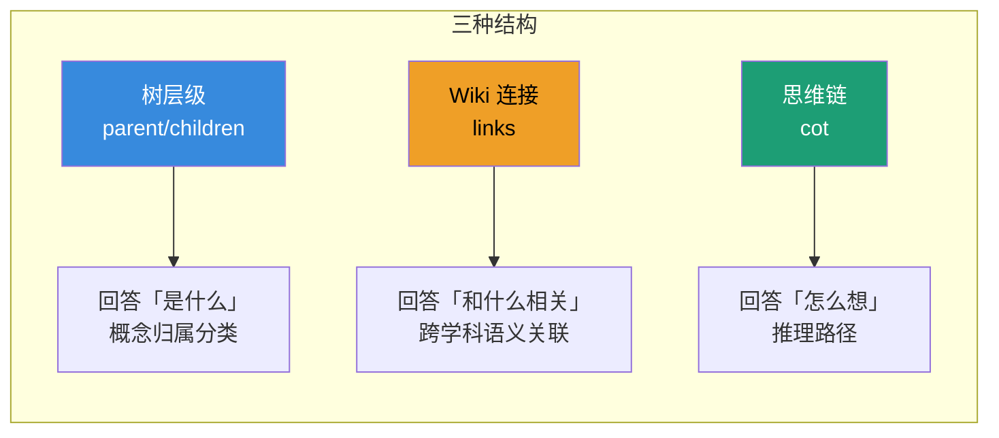
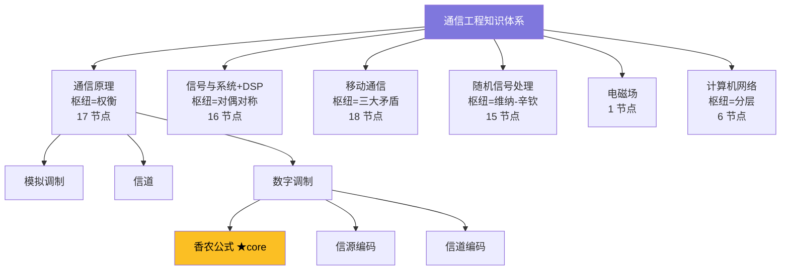

# 通信工程知识库 · Knowledge Base v2

> 一个面向**专业知识问答**的 RAG（检索增强生成）知识图谱项目：把通信工程课程知识组织成「节点 + 树层级 + Wiki 关联 + 思维链」三层结构，配套严谨的多模型评测，验证了一套优于朴素检索的方案。

<p align="center">
  
  
  
  
  
  
  
</p>

---

## 目录

- [项目背景与动机](#项目背景与动机)
- [核心亮点](#核心亮点)
- [知识库设计：节点 / 树 / Wiki / 思维链](#知识库设计节点--树--wiki--思维链)
- [检索方案研究](#检索方案研究)
- [评测体系](#评测体系)
- [项目结构](#项目结构)
- [快速开始](#快速开始)
- [设计文档](#设计文档)

---

## 项目背景与动机

大语言模型（LLM）在回答**专业课程问题**时存在明显短板：对通信原理、信号处理这类需要精确概念和推理的领域，通用模型常出现**概念混淆、要点遗漏**，甚至被常见的"反直觉陷阱题"带偏。

> 典型陷阱：「DSB 与 SSB 的抗噪性能是否相同？」——公平比较下两者相同，但大量资料误传"SSB 更优 3dB"。实测多个中小模型（7B/8B/14B/32B）都答错，因为它们训练时学到的是错误答案。

本项目探索的核心问题是：**如何用外部知识库增强 LLM 的专业问答能力？** 并围绕它完整解决了三个子问题：

| 子问题 | 我的做法 |
|--------|---------|
| **知识如何表示** | 设计「节点 + 树 + Wiki + 思维链」三层知识图谱结构，而非平铺文档 |
| **知识如何检索** | 系统对比 6+ 种检索方案，用重复实验压噪声，找到稳定最优解 |
| **效果如何评测** | 搭建多模型 benchmark（5 档规模 × 裸跑/加知识库 × 严格裁判），量化增益 |

---

## 核心亮点

1. **三层知识图谱结构**：树层级管分类、Wiki 连接管语义关联、思维链管推理——不是"文档库"，是"知识图谱"
2. **结论式内容写法**：每个节点"一句话本质 + 关键结论"前置，让 AI 扫一眼就能提取答案（本项目最大的隐性功臣）
3. **严谨的检索方案研究**：系统对比 6+ 种方案，用重复实验压噪声，得出统计上可靠的结论
4. **反直觉的发现**：内容质量 > 结构复杂度；links 的价值取决于 top-K 宽度和题目难度
5. **全模型正增益**：知识库对 8B 到 DeepSeek 全档模型都是正增益，小模型增益高达 +0.57

---

## 知识库设计：节点 / 树 / Wiki / 思维链

### 1. 设计思想：三种结构回答三个问题

知识的组织，本质要回答三个问题——**这是什么、它和什么相关、该怎么想**。我用三种结构分别回答：



**设计理念一句话**：*树管"在哪"，Wiki 管"和谁相关"，cot 管"怎么想"。* 这三者统一在"节点"这一个载体上——这就是「节点即一切」。

### 2. 节点即一切：三类节点

知识库的每个 `.md` 文件是一个**知识点节点**。按「有没有思维链、有没有子节点」分为三类：

| 类型 | 含义 | 特征 | 数量 |
|------|------|------|:---:|
| `core` | 核心概念 | **带思维链**（为什么→推导→结论），面试检索主力 | 27 |
| `hub` | 分类文件夹 | 统领子节点、组织层次，**无思维链** | 16 |
| `leaf` | 叶子知识点 | 具体知识点，树的末端 | 31 |

**每门课一个"贯穿性枢纽"**（写在核心节点里），让每门课有一条清晰的思维主线，而非知识点堆砌：

| 课程 | 枢纽 | 一句话 |
|------|------|--------|
| 通信原理 | **权衡** | 理论极限 vs 工程实现 |
| 信号与系统 + DSP | **对偶对称** | 一个域周期↔另一个域离散 |
| 移动通信 | **三大矛盾** | 信道/频谱/移动性的对抗 |
| 随机信号处理 | **维纳-辛钦** | 自相关↔功率谱 |
| 计算机网络 | **分层** | 封装 / 解封装 |

### 3. 节点的内部结构（frontmatter）

每个节点用 YAML frontmatter 描述元信息，正文承载知识内容。字段设计如下：

| 字段 | 作用 | 示例 |
|------|------|------|
| `id` | 全局唯一标识，前缀=课程 | `mob-ofdm` |
| `title` | 节点标题 | `OFDM（正交频分复用）` |
| `parent` | 父节点（树的层级） | `mob-anti-fading` |
| `depth` | 树的深度 | `3` |
| `type` | 节点类型 | `core` / `hub` / `leaf` |
| `summary` | 一句话摘要（第一轮检索用） | `高速→N路低速正交子载波…` |
| `links` | Wiki 关联（见下节） | `[{id, relation}, ...]` |
| `cot` | 思维链（core 节点独有） | `{origin, reasoning, conclusion}` |

**一个完整的 core 节点长这样**（节选自真实节点 `mob-ofdm.md`）：

```yaml
---
id: mob-ofdm
title: OFDM（正交频分复用）
parent: mob-anti-fading
depth: 3
type: core
summary: 高速→N路低速正交子载波+CP循环卷积，把频率选择性变平坦
links:
  - id: dsp-dft-fft
    relation: "OFDM 调制解调用 IFFT/FFT 实现，是 DFT 最成功的工程应用"
  - id: dsp-dft
    relation: "CP 把线性卷积变循环卷积"
  - id: mob-small-scale
    relation: "OFDM 对抗的就是多径导致的频率选择性衰落"
cot:
  origin: "频率选择性衰落导致 ISI，怎么把宽带信道变好对付？"
  reasoning: |
    1. 宽带信号在多径下符号周期短 → 严重 ISI
    2. 串/并转换成 N 路低速子载波，符号周期增大 N 倍
    3. 子载波正交 → 省一半频谱
    4. IFFT/FFT 实现，O(N·logN)
    5. CP > 最大时延扩展，线性卷积变循环卷积
    6. 循环卷积既消 ISI 又保正交
  conclusion: "高速→低速 + 正交 + CP 循环卷积，把频率选择性信道分解成平坦子信道"
---

## 一句话本质
OFDM 把一路高速数据拆成 N 路低速正交子载波，用 CP 把线性卷积变循环卷积，
从而把频率选择性信道分解成若干平坦子信道。

## 核心机制（一条链）
高速流 → 串/并转换 → 子载波正交 → IFFT/FFT → 加 CP → 循环卷积 → 信道对角化

## 关键结论（面试必答）
- 子载波正交 → 频谱重叠但互不干扰 → 比 FDM 省一半频谱
- CP > 最大时延扩展 → 消除 ISI
- CP 用循环卷积不用补零 → 既消 ISI 又保正交（ICI）

## 代价与权衡
- PAPR 高 / 对频偏敏感 → 用 CP 开销换抗多径能力
```

### 4. 树层级：六棵主题树

`root` 之下挂六棵主题树，构成课程层次（借鉴知识图谱「领域-主题-概念-实例」组织法）：



**课程层次**（通信工程整体框架，反映在树的结构里）：

```
数学三大件（微积分/线代/概统）                    ← 树根（不建节点）
   ↓
工具课：信号与系统+DSP（微积分）＋ 随机信号处理（概统）  ← 分析工具
   ↓
通信原理                                         ← 绝对核心（系统框架）
   ↓
应用外延：移动通信 / 高频电路 / 计网 / 电磁场天线
```

### 5. links（Wiki 连接）设计

树只能表达「上下级」的层级关系，但知识之间还有大量**跨层级、跨课程的语义关联**——比如「OFDM 用 FFT 实现」这条关系，横跨了移动通信和 DSP 两棵树。这就是 links 的价值。

**links 用 `relation` 字段做语义化标注**，约定了几类关系类型：

| relation 类型 | 含义 | 示例 |
|--------------|------|------|
| 应用 | 一个知识是另一个的工程应用 | OFDM ↔ FFT（DFT 最成功的应用） |
| 支撑 | 一个知识是另一个的理论基础 | 最小相位 ↔ 均衡器（逆系统稳定性的前提） |
| 同源 | 本质是同一个概念 | 白噪声 ↔ AWGN |
| 对抗 | 一个技术对抗另一个现象 | OFDM ↔ 频率选择性衰落 |
| 对偶 | 数学上的对偶关系 | 信源编码(去冗余) ↔ 信道编码(加冗余) |
| 区分 | 易混概念的区别 | 数据报 ↔ 虚电路 |

**关键价值**：links 能救回「关键词完全不重合、但语义强相关」的节点——纯关键词检索永远匹配不到「均衡器」和「最小相位」的关联，links 顺着图一跳就补上了。全库共 **260 条连接，其中 73 条是跨树连接**。

### 6. cot（思维链）设计

`core` 节点独有 `cot` 字段，用**三段式**记录「为什么这样想」：

| 字段 | 作用 |
|------|------|
| `origin` | 问题的起点（引出这个知识点的原始困惑） |
| `reasoning` | 推理链（分步，每步一个逻辑跃迁） |
| `conclusion` | 结论（收束，提炼核心） |

**为什么要 cot**：让 AI 注入知识时，得到的不是"孤立结论"而是"完整推理路径"——这决定它能否**推导出正确的下游结论**，而不仅仅是复述。以香农公式节点为例：

```
origin:   "怎么量化信息量？信道到底能传多少？"
reasoning:
  1. 自信息 I = -log₂P：概率越小越意外、信息量越大
  2. 信息熵 H(X)：信源的平均不确定度
  3. 信道有噪声 → 接收端残留 H(X|Y)（条件熵）
  4. 互信息 I(X;Y) = H(X) - H(X|Y)：真正传过去的信息
  5. 信道容量 = 互信息的最大值；AWGN 下输入取高斯分布时达到
     → 推导出 C = B·log₂(1+S/N)
  6. 对数为什么：功率每翻倍(+3dB)，容量只 +1 bit/Hz（边际递减）
  7. 带宽和信噪比可互换：深空通信 S/N 极低，用超宽带宽稀释
conclusion: "信道容量是信息论给出的上限；根本限制是噪声"
```

### 7. 结论式写法（内容模板）

这是本项目**最重要的经验**——正文采用固定模板，让 AI 扫一眼就能提取答案，而不是读完自己归纳：

```
## 一句话本质     ← 第一行就是答案核心（TL;DR）
## 为什么需要它   ← 解决什么问题
## 核心机制（一条链） ← 用 → 箭头串成推理路径
## 关键结论（面试必答） ← 结论式写法，直接可抄
## 代价与权衡     ← 呼应全库的「权衡」枢纽
```

> 这个"结论式写法"后来被 benchmark 验证是**最大的隐性功臣**：它让朴素 TF-IDF 关键词检索就已经能覆盖 90% 的关联，远超结构设计带来的增量。

---

## 检索方案研究

### 1. 检索流程

最终方案是一个**四阶段流水线**：


### 2. 检索方案演进史（6+ 方案系统对比）

这是本项目研究最充分的部分。我从「模型自主选」一路迭代到「top-3 + links + LLM」，每一代方案都做了实测对比：

| 方案 | 做法 | 召回率* | 结论 |
|------|------|:---:|------|
| A | 模型看完整目录自主选节点 | 88% | ❌ 弱模型选不准，慢且贵 |
| B | 纯 TF-IDF top-3 | 82% | ❌ 无模型参与，最低 |
| C | TF-IDF top-10 + 模型精挑 | 92% | ✅ 开创"初筛+精挑"框架 |
| D/E/F | 排除 hub / links 扩展变体 | 91~95% | ⚠️ 差异在噪声内 |
| **最终** | **top-3 + links + LLM** | **79.1%**† | ✅ 更准更省 |

\* 前五行为早期 35 题库；† 最终行为 116 题完整题库（口径不同）。

**关键转折**：方案 C 开创的「程序初筛 + 模型精挑」框架，把召回率从 82% 拉到 90%+，是**唯一的大收益**；而 links 扩展、排除 hub 都是理论正确但增量有限的微调。

### 3. links 研究的诚实结论（三段式）

对 links 做了多轮严格验证，结论经过了「误判 → 探索 → 真相」的完整迭代：

| 阶段 | 当时的结论 | 后来的修正 |
|------|-----------|-----------|
| **误判** | links 选节点扩展零收益 | 建立在"top-8/10 已够宽"的隐含前提上 |
| **探索** | links 该用在"注入"环节（+9 覆盖） | 但注入膨胀 3 倍，性价比低 |
| **真相** | **links 价值取决于 top-K 宽度** | top-K 越窄，links 救回的正确答案越多 |

最终发现：**links 的价值随 top-K 收窄而增大**——top-2 时 links 增量 +18 点，top-6 时只剩 +6 点。因为 top-K 越窄，初筛漏掉的正确答案越多，而这些漏掉的恰好是 links 邻居能救回的。完整题库上 links 扩展带来 **+4.8 个百分点**的召回提升。

### 4. top-K 扫描发现

对 top-K 从 2 到 6 做了纯程序覆盖扫描，找到甜点：

| top-K | 纯 TF-IDF | +links 扩展 | 平均候选 |
|:---:|:---:|:---:|:---:|
| 2 | 78% | 96% | 6.9 |
| 3 | 86% | **97%** | **9.3** |
| 4 | 91% | 99% | 11.8 |
| 5 | 92% | 99% | 14.3 |

**top-3 是甜点**：召回 97%、候选仅 9.3 个（比朴素 top-10 还省），精挑不吃力。

---

## 评测体系

### 1. benchmark 设计（116 题完整题库）

题库按两个维度分层，合并了全部历史题库（6 个版本去重 + 修正标注）：

| 维度 | 分类 | 题数 | 考什么 |
|------|------|:---:|------|
| **难度层级** | L3 单科 | 55 | 单一门课的知识点 |
| | L4 跨学科 | 61 | 跨树/跨课程的串联 |
| **题型** | 常规题 | 86 | 标准知识点 |
| | 难题（相似概念/多节点） | 15 | 选节点容易错 |
| | 反直觉题 | 15 | 表面规律人人会背，深层机制只有真懂才答得出 |

**设计意图**：L3 测「单点选得准不准」，L4 测「跨树关联找不找得到」——难题和反直觉题的正确答案 TF-IDF 排名靠后，正是 links 扩展发挥价值的地方。

### 2. 评测方法（严谨性保障）

1. **多模型对照**：DeepSeek + Qwen3(8B/14B/32B) + GLM-5.2，覆盖 8B 到大模型全档
2. **裸跑 vs 加知识库**：同一题跑两遍，只变"是否注入知识库"
3. **裁判模型打分**：qwen-max 按严格分档（关键错误重扣、漏要点扣分）
4. **重复实验压噪声**：对关键结论重复跑 3 次，识别出精挑有 ±1~2 点随机噪声，避免误判
5. **数据清洗**：修正了题库里混入的分类节点标注、重复题目 id 等问题

### 3. 评测结果

**检索方案对比（116 题完整 benchmark）**：

| 方案 | 召回率 | 平均候选 | 说明 |
|------|:---:|:---:|------|
| 纯 top-10 + LLM | 74.3% | 10.0 | 朴素检索基线 |
| **top-3 + links + LLM** | **79.1%** | **9.8** | ✅ 最终方案（更准更省） |
| top-4 + links + LLM | 80.1% | 12.3 | 略高但候选多 20% |

**模型增益（裸跑 vs +知识库，qwen-max 裁判）**：

| 模型 | 规模 | 裸跑 | +知识库 | 增益 |
|------|:---:|:---:|:---:|:---:|
| Qwen3-8B | 8B | 8.23 | 8.80 | **+0.57** |
| Qwen3-14B | 14B | 8.26 | 8.83 | **+0.57** |
| Qwen3-32B | 32B | 8.37 | 8.54 | +0.17 |
| GLM-5.2 | 大模型 | 8.46 | 8.86 | +0.40 |
| DeepSeek | 大模型 | 8.57 | 8.80 | +0.23 |

**关键结论**：

- 知识库对**全部 5 档模型都是正增益**，没有任何模型被拖累
- **小模型增益更大**（+0.57 > 大模型 +0.23），因为裸跑分低、可补空间大——这推翻了"越大增益越大"的直觉
- 在反直觉难题（严格裁判）上，增益进一步放大到 **+1.27**（14B），验证了"题目越难、知识库价值越大"

---

## 项目结构

```
knowledge-base/
├── knowledge-v2/            # 知识库本体（核心）
│   ├── nodes/               # 74 个 .md 节点（每个 = 一个知识点）
│   └── _meta/tree.json      # 树结构索引（build_tree.py 自动生成）
├── benchmark/               # 评测体系
│   ├── questions_full.json  # 116 题完整题库
│   ├── 评测报告_*.html      # 可视化评测报告（含完整实验史）
│   └── results/             # 评测原始数据（jsonl）
├── tools/                   # 工具脚本
│   ├── kb_benchmark.py      # 评测主脚本（多模型 × 裁判打分）
│   ├── test_top34.py        # 检索方案对比测试
│   ├── build_tree.py        # 生成树结构索引
│   └── kb_lint.py           # 知识库完整性校验
└── docs/                    # 设计文档（01-06）
```

---

## 快速开始

```bash
# 1. 校验知识库完整性
python tools/kb_lint.py

# 2. 生成树结构索引
python tools/build_tree.py

# 3. 跑评测（需配置 API key，见 tools/.env.example）
python tools/test_top34.py
```

---

## 设计文档

完整的设计思路、检索集成、评测体系见 `docs/` 目录：

- `01-设计总纲.md` ~ `05-任务清单.md`：设计阶段的方法论与规划
- `06-项目归档总结.md`：**全部实验数据 + 踩坑记录 + 核心洞察**

可视化报告见 `benchmark/评测报告_*.html`（含时间线、方案演进、完整实验史）。

---

## License

本项目采用 [MIT License](LICENSE)。
